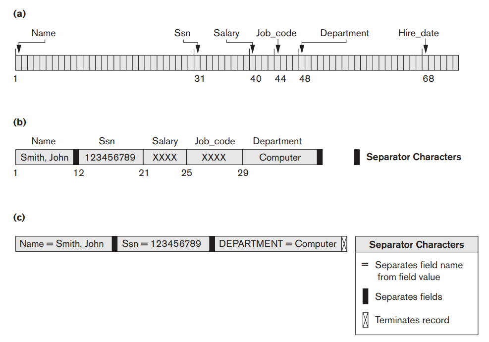
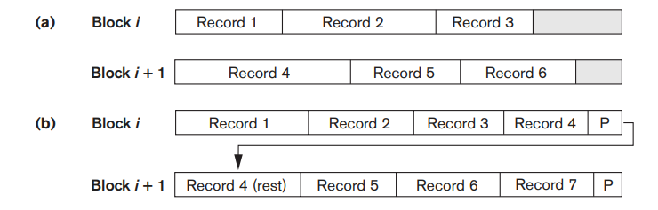

# 레코드의 저장 방식

### 용어 정리

- 파일: 레코드의 연속 집합. 일반적으로 동일한 레코드를 의미한다.
- 고정 길이 레코드: 파일 내 존재하는 모든 레코드가 정확히 동일한 사이즈를 갖는 레코드
- 가변 길이 레코드: 파일 내 존재하는 레코드의 길이가 서로 다른 경우
  - **가변 길이 필드**를 갖는 경우
  - **옵션 필드**를 갖는 경우

- 고정 길이 레코드: 인덱스를 통해 필드에 바로 접근
- 가변 길이 레코드: 구분자를 통해 필드를 구분
- `EOR`: 레코드의 끝을 의미하는 구분자

## 레코드 blocking

레코드 파일은 블록에 할당된다. 그래야만 디스크가 블록을 읽어 메인 메모리에 전달할 수 있기 때문이다.

그런 할당 과정을 **Blocking** 이라 칭한다.

**Blocking factor**: 한 블럭에 들어갈 수 있는 레코드의 수를 의미.

### Spanned block vs. Unspanned block

블록 내 레코드를 위치 시킬 때의 방식에 따라 blocking 방식을 구분한다.

- Unspanned block
  - 레코드 내에 블록을 위치 시킬 때, 블록의 크기가 레코드의 잉여 공간을 초과하는 경우 다음 블록에 위치시키는 방법
  - **공간 낭비**가 발생한다는 단점 존재
- Spanned block:
  - 레코드 내에 블록을 위치 시킬 때, 블록의 크기가 레코드의 잉여 공간을 초과하는 경우 잉여 공간 만큼 레코드를 위치시키고 포인터를 둬서 다음 레코드를 가리키도록 하는 방법
  - **1개의 레코드를 보기 위해 2개의 블록에 접근**해야 하는 단점 존재
  - **멀티미디어 타입 데이터**를 저장할 때 많이 쓰인다.

## 파일 블록 할당 방법

파일의 블록을 어떻게 디스크에 할당할 것인지?에 대한 논의

1. Contiguous allocation
   - 전체 파일을 연속되게 디스크에 위치시키는 방법
   - **파일을 읽을 때 매우 유리함!**
   - 그러나 파일이 확장될때의 어려움이 존재한다.
2. Linked allocation
   - 마치 Linked list처럼 파일을 연결하는 방법
   - **파일 전체를 읽는데에는 시간이 오래 걸린다.**
   - 그러나 파일이 확장될때 유리함.
3. Combination allocation
   - File block 자체는 연결되게 위치시키되, 클러스터 단위는 linked allocation 방식으로 위치시키는 방법.
4. Indexed allocation
   - FAT 방식과 동일한 방법.
   - 파일 블록의 주소가 담긴 인덱스 블록을 저장하는 방법

### 파일 헤더

파일 헤더에는 파일에 대한 메타데이터가 저장 된다.

> 메타데이터: 필드의 길이, 필드의 순서, 레코드의 종류 코드 등...
