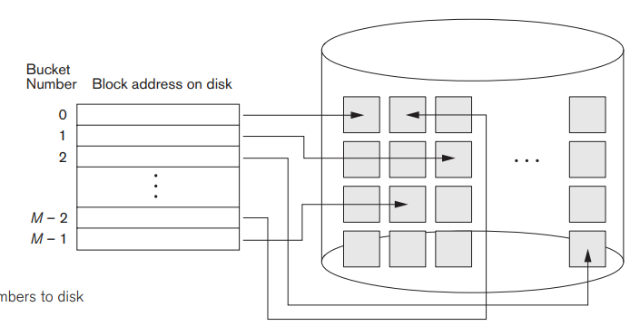
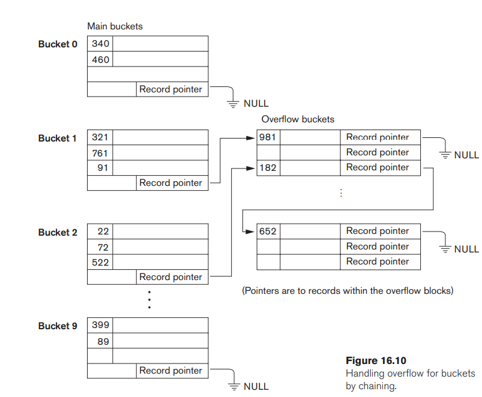

# Hashed file

해싱 기법을 사용해 레코드가 저장될 위치를 정하는 파일 구조 기법

역시나 해싱 기법은 충돌 문제가 발생하는데, 충돌 문제를 어떻게 해결하는지 알아보자.

### Open addressing

열린 주소 공간 기법.
충돌이 발생했을 때, 충돌이 발생한 인접한 빈 공간에 레코드를 저장하는
방법이다.

- 레코드 삽입 시...
  - 해시 값의 위치가 비어있다면 바로 삽입한다.
  - 만약 그 위치에 레코드가 이미 존재한다면 삽입하지 않고 다음 주소값으로 이동한다.
  - 빈 공간이 나올 때까지 이동하며 비어있는 공간에 레코드를 저장한다.
- 레코드 탐색 시...
  - 탐색하려는 해시 값의 위치로 이동한다.
  - 이후 빈 공간이 나올 때까지 선형적으로 확인하며 레코드를 탐색한다.

특징

- 충돌을 해결하는 방법이지만, 충돌 발생률은 올라간다.
- 삽입과 탐색을 할 때 불필요한 연산이 계속될 가능성이 존재한다.

### Chaining

충돌이 발생했을 때, 충돌이 발생한 레코드에 연결리스트를 추가하는 방법이다.

- 레코드 삽입 시...
  - 해시 값의 위치가 비어있다면 바로 삽입한다.
  - 만약 그 위치에 레코드가 이미 존재한다면 `Overflow pointer`를 확인한다.
  - 해당 `pointer`값을 재귀적으로 따라가 최종 위치에 레코드를 삽입한다.
- 레코드 탐색 시...
  - 탐색하려는 해시 값의 위치로 이동한다.
  - 레코드를 찾거나 `overflow pointer`가 `null`이 될 때까지 재귀적으로 탐색한다.

특징

- 충돌이 일어났을 때 레코드가 저장되는 별도의 공간이 있다. (`overflow space`)
- 동일한 해시 값을 갖는 레코드가 많은 경우 탐색에 있어 불필요한 연산의 가능성이 존재한다.

### Multiple hashing

해시 함수를 하나만 사용하지 않고 여러개의 해시 함수를 사용하는 방법.

첫 번째 해시 함수에서 충돌이 발생하는 경우, 두 번째 해시 함수를 적용하여 저장 위치를 결정한다.

만약 2차 이상의 해시 함수에서 충돌이 발생하는 경우 그것에 대한 대안책을 생각해둬야함.

## Internal Hashing vs. External Hashing

**Internal Hashing**: 한 파일 혹은 한 테이블에 대한 해싱 기법. 메인 메모리 상에서의 해싱이라고 생각하면 될 것 같다. 해시 함수의 결과가 곧 **테이블 상의 위치** 가 된다.

**External Hashing**: 디스크 상에서의 해싱 기법. 해시 함수의 결과가 곧 **디스크 상의 상대 버킷(블록) 주소**가 된다.

상대 버킷 주소를 절대적인 주소로 변경하기 위한 주소 테이블을 저장해야 한다.

충돌 방지 기법으로는 `Chaining` 기법을 사용한다.

### External Hashing

위 사진처럼 해시 값에 따라 버킷의 번호가 나오고, 그 값을 참조하여 실제 버킷에 접근할 수 있다.

Chaining 기법 사용할 때 주의점

- 탐색 시, 해당 되는 버킷을 전체 탐색한 후 없으면 `Overflow bucket`에서 탐색한다.
- 삽입 시, 탐색 하여 빈 공간에 삽입한다.
- 삭제 시, 삭제할 레코드를 찾은 이후 해당 레코드를 삭제한다. 단, `Overflow buckets`에 이후 레코드가 존재하면 한 칸 당겨준다.
- 수정 시...
  - `Key field`를 수정하는 것이라면 삭제 후 재삽입을 한다.
  - `Key field`가 아니라면 단순하게 수정한다.

### Static Hashing

정적 해시란, 버킷의 수가 정해진 해시 기법을 의미한다.
버킷의 수를 너무 작게 잡거나 크게 잡게 되는 경우 공간의 낭비 혹은 공간의 부족 현상이 발생한다.

이를 해결하기 위해선 공간이 낭비되거나 부족할 때 `재구성`하여 해결할 수 있다. => `Dynamic Hashing`의 필요성 대두

## Dynamic Hashing

Dynamic Hashing은 정적 해싱의 반대말로 다음과 같은 기법이 존재한다.

1. Extendible Hashing
2. Linear Hashing
3. Dynamic Hashing

### Extendible Hashing

키 값을 이진수로 표현하고, 버킷의 개수 또한 2의 승수인 기법.

디렉토리는 2진수의 주소를 가짐.

- `global depth`: 디렉토리의 깊이. 디렉토리는 2^`global depth`만큼의 개수를 가짐.
- `local depth`: 버킷 내의 디렉토리의 깊이. 로컬 깊이가 의미하는 바는 "**해당 버킷에 존재하는 주소의 앞자리는 로컬 깊이만큼 같음**"임.
  - 예를 들어, `local depth`가 2라면 해당 버킷에 존재하는 모든 주소는 앞 2자리만은 반드시 똑같음.
  - `local depth`는 반드시 `global depth`보다 작거나 같다.

`global depth`를 증가시키거나 감소시켜 `Dynamic hashing`을 구현할 수 있다.

- `global depth` = `local depth`: 이 경우엔 `local depth`를 증가시킨다.(버킷 수 증가)
- `global depth` > `local depth`: 이 경우엔 `local depth`를 감소시킨다. (버킷 수 감소)

특징: 속도와 공간의 효율성에서 우수하지만 삽입, 삭제 등을 진행할 시 두 개의 블럭에 접근해야한다.

### Dynamic Hashing

`Extendible Hashing`과 동작 방식은 동일하다. 다만, 디렉토리를 트리 형태로 유지하는 것이 차이점이다.

### Linear Hashing

버킷 오버플로우가 발생했을 때, 해시 함수의 나눠주는 값을 2배해주는 방식이다. 이렇게 생긴 새로운 버킷은 실제 물리적인 공간을 2배로 차지하지 않는다.
