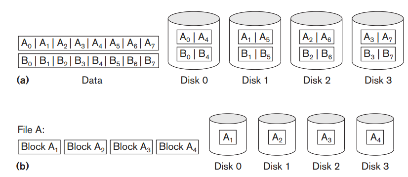
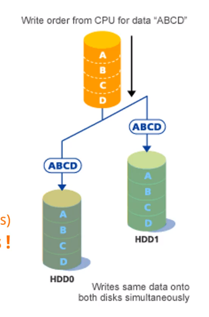
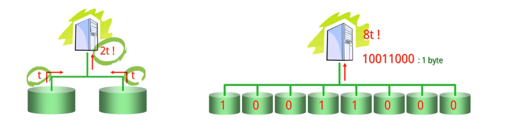
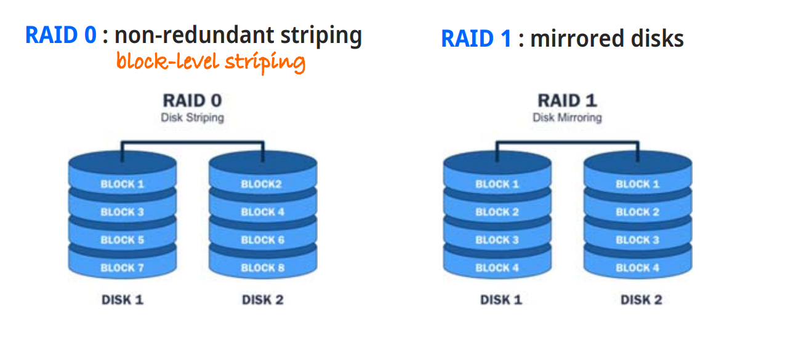
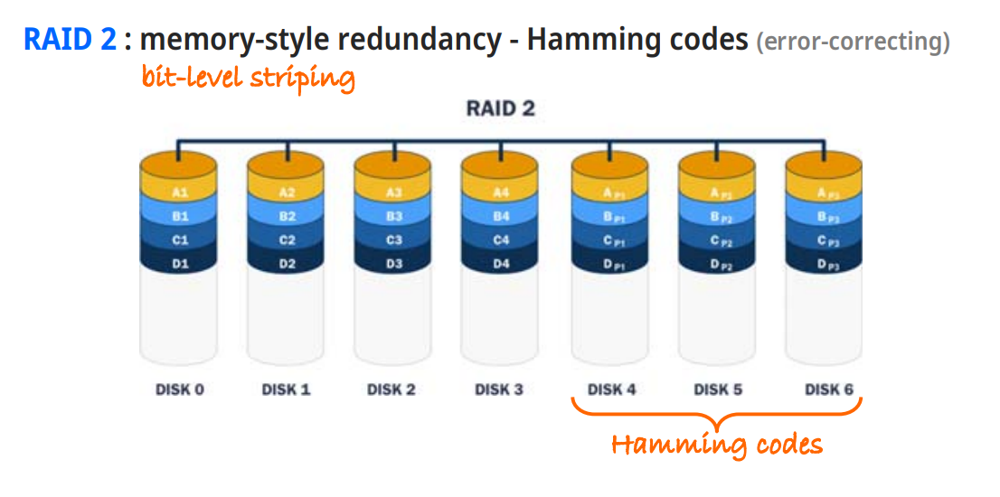
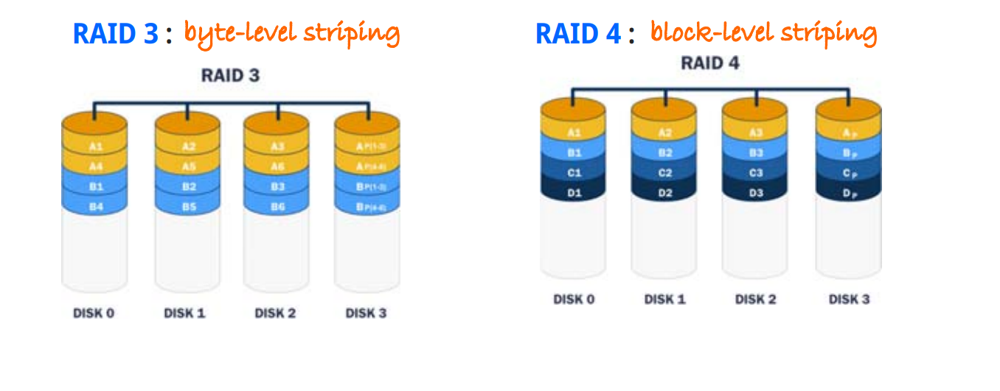
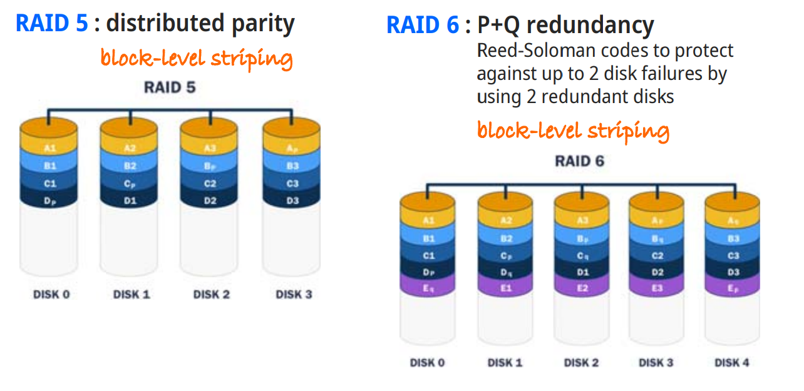
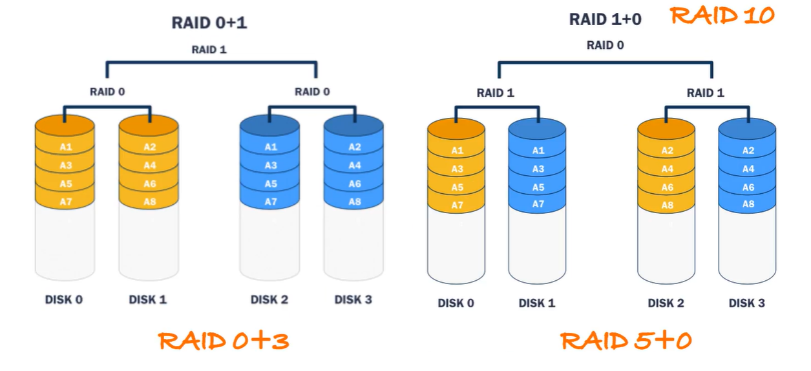

# RAID

**RAID**란, Redundant Arrays of Inexpensive Disks의 약자로 사용되었다. 초기엔 디스크의 가격이 비쌌기 때문에 디스크의 가격을 낮출 필요가 있었다. 따라서 저렴한 디스크를 여러개를 묶어 하나의 큰 디스크로 활용하였다.

그러나 근래에는 디스크의 가격이 저렴해졌기에 비용 측면보단 안정성과 속도 측면에서의 RAID 시스템이 활용된다.

디스크의 성능을 높이기 위해 데이터를 흩어서 저장한다.

- `bit level striping`
- `block level striping`

- (a): 데이터를 비트 단위로 쪼개어 여러 디스크에 저장한 방식
- (b): 파일을 블럭 단위로 쪼개어 디스크에 저장하는 방식

## RAID를 통한 신뢰도 및 성능 증가

n개의 디스크를 하나의 디스크로 사용한다고 가정하면, 전체 시스템이 고장 확률도 n배가 된다.

이를 극복하기 위해 RAID를 활용한다.

### Mirroring

기존 데이터를 완전히 복사한 값을 가지고 있는 디스크를 두는 방법
동시에 두 디스크가 고장나지만 않으면 디스크를 복구할 수 있다.

### Striping

또한, 데이터를 여러 디스크에 걸쳐 저장을 해둔다면 같은 시간내에 더 많은 데이터를 가져올 수 있기 때문에 성능 향상 측면에서도 이점이 존재한다.

단, 하나의 디스크가 고장나게 되는 경우 전체가 고장나는 것과 동일한 효과를 불러 일으킬 수 있다. 이것을 보완하는 RAID 방법이 존재한다.

## RAID 0 ~ 6

- RAID 0
  - Redundancy가 없고, `block-level striping`을 사용해 성능 확장
- RAID 1
  - 성능 향상이 없고, Mirroring 디스크만 존재하는 방식

- RAID 2
  - Hamming code를 사용하는 방식
  - 특정 위치의 에러를 찾기 위해 3 비트를 사용. (2비트는 위치, 1비트는 패리티 비트)
  - 해밍 코드를 활용해 어떤 정보가 파괴되었을 때 그것을 복구함.

- RAID 3
  - `Byte level striping`
  - 최근의 하드 디스크는 손실된 데이터와 데이터의 위치를 알 수 있다. 따라서 해밍 코드를 없앰.
  - 복구에는 한 바이트만 필요함. (패리티 바이트)
- RAID 4
  - `Block level striping`
  - 패리티 코드가 블럭 단위임

- RAID 5
  - `Block level striping`
  - RAID 4의 경우 패리티 블럭이 한 곳에 존재함.
  - 따라서 해당 디스크에 대한 오버헤드가 발생할 수 있음.
  - 그러기에 패리티 블럭을 흩어놓아 저장함.
  - 디스크에 정보를 작성할 땐, 해당 디스크와 해당 디스크의 패리티 블럭에 동시에 정보를 작성한다.
- RAID 6
  - `2 redundant disks`
  - 패리티 블럭을 2개의 디스크에 두는 방식
  - 안정적이지만 많이 사용되진 않음

### Hybrid RAID

- RAID 0+1
  - 성능이 좋은 RAID 0를 그대로 미러링 하여 구축한 방식
- RAID 1+0

  - 미러링 된 RAID 1을 두 개 두는 방식

- RAID `n` + `m`
  - RAID `n`이 RAID `m` 방식으로 묶인 하이브리드 방식
