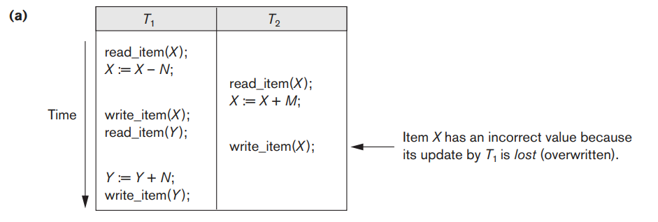

# Why concurrency control is needed

동시성 제어를 하지 않았을 때 발생할 수 있는 문제들

- Lose update
- Dirty read
- Incorrect summary
- Unrepeatable read

### Lost Update

위 예시를 보면, `T1` 트랜잭션이 `X`에 대해 실행한 쓰기 작업이 전혀 반영되지 않았다.

이렇게 **수정된 값이 반영되지 않는 현상**을 `Lost update`라 한다.

### Temporary Update (Dirty read)

위 예시엔 오류가 없어보인다.
하지만, `T1` 트랜잭션이 수행될 때 마지막에 오류가 났다고 해보자. 그렇게 되면 `T1`의 수행 뿐 아니라 `T2`의 수행도 없었던 것으로 되어야 한다.

왜냐하면, `T1`이 영향을 준 `X`값을 `T2`가 변경하였기 때문이다. 따라서 `T1`의 수행만 없었던 것으로 하면 이전의 값을 찾을 수 없다.

이렇게 **읽은 값이 잘못된 값인 현상**을 `Dirty read`라 한다.

### Incorrect summary

위 예시에서 `T3`는 모든 아이템의 합을 구하려고 하고 있다.
`X`는 변경된 값을 집계하였고, `Y`는 변경되기 이전의 값을 집계하였다. 그러나, `Y`는 `T1`에 의해 변경되어야 했다.

이렇게 **합을 구하려고 할 때 옳지 못한 값을 읽어 합하는 현상**을 `Incorrect summary`라고 한다.

### Unrepeatable read

다음과 같은 상황을 상상해보자.

> 트랜잭션이 이뤄지는 중에 `X`를 두 번 읽을 일이 생겼다.
> `X`를 처음 읽었는데, 두 번째 읽기 이전에 다른 트랜잭션이 수행되어 `X`가 변환되었다.
> 이 경우, 트랜잭션 도중 값이 변경되었기 때문에 문제가 발생한다.

어떤 문제가 발생할 수 있을까?

- 항공편 예약이나 숙소 예약을 할 때, 예약을 시작할 때만 해도 예약이 가능했었으나 마지막으로 확인하니 이미 예약이 되어있는 불상사를 상상해볼 수 있다.
