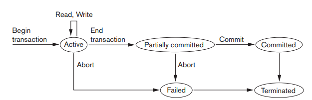

# Why recovery is needed.

트랜잭션은 데이터베이스 처리의 논리적 단위이다.
따라서, 트랜잭션은 실행되었든지 되지 않았든지 둘 중 하나의 상태만을 가져야한다. 그 상태를 다음과 같은 용어로 나타낸다.

- Committed: 트랜잭션이 잘 수행되어 DB에 그 결과가 반영된 상태
- Aborted: 모종의 이유로 트랜잭션이 반려된 상태

만약, 트랜잭션 도중 어떠한 일이 일어나 `aborted`된다면 해당 트랜잭션이 DB에 미치는 영향은 없어야 한다.

## Transaction process

트랜잭션이 이뤄지는 과정을 표현한 그림

- 트랜잭션이 시작되면, 읽고 쓰는 과정을 거친다.
  - 그 과정에서 오류가 발생하면 `abort`상태로 넘어간다.
- `Partially committed` 단계는 수정된 데이터가 버퍼에서 Disk로 넘어가기 이전 단계를 의미한다.
- 이후, Disk에 완전히 넘어가 `commit`되면 비로소 `committed` 상태로 변환된다.
