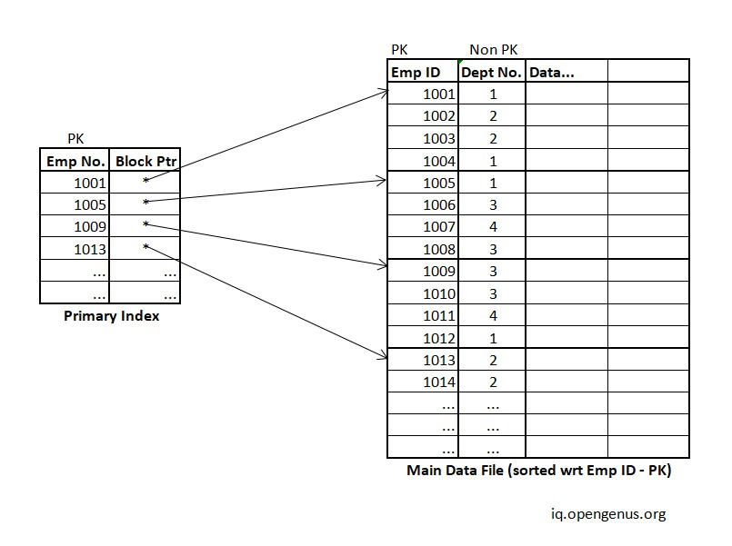

# What is index structrue?
보조기억장치는(HDD) 주기억장치(Memory)에 비해 접근 시간이 매우 크다. 따라서, 보조기억장치에 존재하는 어떠한 레코드를 찾기 위해선 전략적인 접근이 필요하다. 이것을 도와주는 것이 **Index structure**, 인덱스 구조이다.

인덱스 구조는 실생활에서 자주 찾아볼 수 있는데, 종이 사전의 인덱스가 대표적이다. 종이 사전은 기재되어 있는 방대한 단어 때문에 매우 두꺼운데, 이것을 한장 한장 뒤져가며 원하는 단어를 찾는 것은 매우 비효율적인 일이다.
그래서 책의 측면에 'A', 'B', 'C' 등 알파벳 인덱스가 존재하는 것을 확인 할 수 있다. 만약 내가 사전에서 `apple`을 찾고 싶다면, 'A' 인덱스가 가리키는 페이지를 열어 찾아보면 된다.

---
## Single-Level ordered indexes
- Single-Level ordered indexes란, 한 단계만을 거쳐 생성된 인덱스 구조를 의미한다. 
- 전체 레코드가 정렬되어 있음을 가정한다.
- Single-Level ordered indexes에는 다음과 같은 종류가 있다.
    - Primary index: 인덱스가 가리키는 field가 키인 경우
    - Clustering index: 인덱스가 가리키는 field가 유일성이 없는 경우
    - Secondary index: 인덱스가 가리키는 field가 기본 키가 아닌 경우

### Primary index
- Primary index는 인덱스가 가리키는 field가 키인 경우의 인덱스를 지칭하는 용어다.
- Primary index는 2가지의 정보로 이루어져있다.
    - `Key(i)`, `Pointer(i)` | `Key(i)`는 해당 Pointer가 가리키는 값, `Pointer(i)`는 실제 물리적 주소를 의미한다.
- Primary index는 모든 레코드의 정보를 가지고 있지 않기 때문에 *sparse index*라고 칭하기도 한다.
- `P(i)`가 가리키는 블럭에는 `K(i)` ~ `K(i+1)` 사이의 값이 존재한다. (정확히는 `K(i+1)`은 존재하지 않음)
- 섹터(블럭)의 첫번째 레코드를 *anchor record* 라고 칭하는데, Primary index가 가리키는 모든 레코드는 *anchor record* 이다.

_Primary index_ 의 예시

### Clustering index
- Clustering index는 인덱스가 가리키는 field가 유일성이 없는 경우의 인덱스를 지칭하는 용어다.
- 가령, 학과를 기준으로 인덱스를 만든다고 해보자. 한 학과에 속한 학생은 여러명이 될 수 있기 때문에 다른 접근 방법이 필요하다. 총 2가지의 방법이 존재하는데 사진을 통해 알아보자.

_블럭 내의 빈 공간을 허용하지 않는 방식_

- 인덱스가 가리키는 레코드는 해당 값이 처음으로 등장하는 블럭의 레코드를 가리킨다.
- 이 방식의 경우, 공간의 효율성이 좋아진다는 점이 존재하지만 특정 값을 찾기 위해 2번 이상의 블록 접근이 필요하다는 단점이 존재한다.

_블럭 내의 빈 공간을 허용하는 방식_

- 인덱스가 가리키는 레코드는 해당 값을 가진 최초의 레코드가 되는 방식.
- 이 방식의 경우, 한 번의 접근만으로 값을 찾을 수 있다는 장점이 있지만 Overflow되는 레코드를 가리켜줄 포인터가 추가적으로 필요하다는 단점이 있다.
- 물론 찾으려는 레코드가 Overflow되는 경우 블록 접근 횟수가 추가된다. (질문)

### Secondary index
- Secondary index는 인덱스가 가리키는 field가 기본 키가 아닌 대체 키인 경우의 인덱스를 지칭하는 용어다.
- 일반적으로 모든 레코드를 기본 키를 기준으로 정렬하기 때문에 대체 키를 통한 접근은 Primary index 만큼 빠르지 않다. 이를 해결하기 위해선 모든 레코드를 대체 키를 기준으로 정렬하여 저장한 또 다른 테이블이 존재해야하는데 이는 비효율적이다.
- 따라서, 모든 레코드에 대한 index를 생성해 전략적인 접근을 가능하게 한다.
- 참고로 이러한 index 방식을 *dense index* 라 칭한다.

_Secondary index의 예시_

- 보다시피 모든 레코드에 대한 인덱스를 생성해 해당 레코드의 물리적 주소를 저장하고 있다.

> 🤨 Non-key field의 인덱스라면 어떻게 설계해야할까?
모든 레코드에 대한 인덱스를 생성해줘야 하는데, 중복되는 값이 존재한다면 하나의 물리적 주소로만 표현할 수 없게 된다.

이 문제를 해결하기 위한 방법이 3가지 존재한다.
1. 레코드의 개수 만큼 키 값을 증가시켜주는 방법.
2. 한 개의 키에 여러개의 레코드 주소를 저장하는 방법.
3. 레벨을 하나 증가시키는 방법.

위 세가지 방법 중 마지막 방법의 예시를 살펴보자.

_Non-key field 에 대한 Secondary index_

- 1단계의 인덱스는 키 값과 해당 키 값을 가지고 있는 레코드의 주소 집합을 담고 있는 블럭의 주소를 가지고 있다.
- 레코드의 주소 블럭에서는 해당 값을 가진 모든 레코드와 매핑되어 있음을 확인할 수 있다.