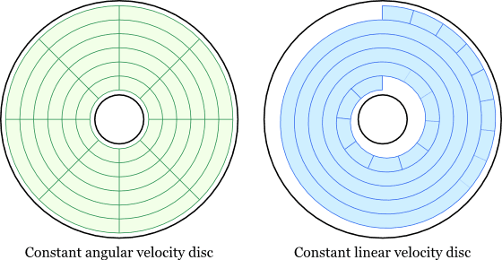
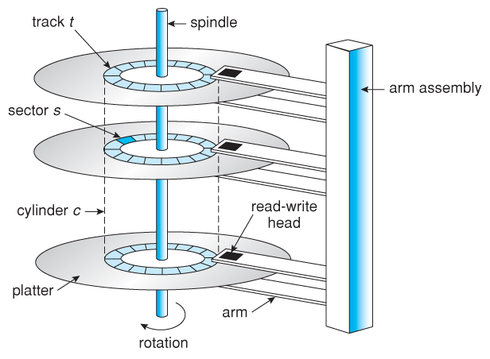

# 하드 디스크의 구조

레코드를 저장 장치에 어떻게 저장할 것인가를 논하기 전에 디스크의 구조에 대해 알아보자.

- 한 장의 디스크는 `Platter`라 칭하며, 공간의 효율을 위해 양면에 모두 정보가 저장된다.
- 모든 디스크는 `Spindle`이라고 하는 기둥에 고정되어 있다.
- `Actuator`에 `Arm`이라고 하는 데이터를 읽고 쓸 수 있는 장치가 부착되어 있다.

## CAV vs. CLV

디스크는 원형이기 때문에 디스크에 데이터를 어떻게 기록 할것인가?에 대한 합의가 필요하다. 그에 대한 2가지 방법인 `CAV`, `CLV`에 대해 알아보자.

- Constant Angle Velocity
  - 디스크의 중심을 기준으로 디스크의 외부까지 선을 그어 동일한 면적의 부채꼴을 얻었다고 가정해보자.
  - 해당 부채꼴을 동심원 단위로 잘랐을 때, 디스크 중심에 가까운 동심원과 디스크 외부에 가까운 동심원이 동일한 데이터 크기를 가지는 방식이다.
  - 이 방식은 디스크의 면적에 대한 낭비가 존재하지만, 사용이 편하기 때문에 하드디스크 등에 사용되는 방식이다.
- Constant Linear Velocity

  - 디스크의 중심부터 외부까지 하나의 줄로 채운다고 생각해보자. (소화전에 존재하는 소방 호스를 생각)
  - 그 줄을 일정 간격으로 끊어서 데이터 구역을 나눠주는 방식이다.
  - 그렇게 나뉜 데이터 구역의 크기는 모두 동일하다.

## 디스크 용어

디스크의 부분을 칭하는 다양한 용어에 대해 알아보자.

- 트랙: 디스크에 존재하는 하나의 동심원을 칭하는 용어
- 섹터: 디스크에서 구분된 단위
- 기하학적 섹터: 디스크의 부채꼴 모양
- 실린더: 디스크 집합이 존재할 때, 그 집합에 속한 동일한 트랙을 부르는 용어.

디스크의 섹터와 블럭의 차이점

- 디스크 섹터: 디스크의 **물리적 구분 단위**
- 디스크 블럭(페이지): OS가 디스크에 접근할 때, 접근할 수 있는 **논리적 최소 단위**
  블럭은 **Interblock gap**에 의해 서로 구분된다.

> **Interblock gap**이란?
> 블럭 사이를 구분해 주기 위해 필요한 공간. 만약, 모든 블럭이 연속되게 배치된다면 디스크를 읽는 입장에서 이것을 구별해내기 쉽지않다.

## 디스크 주소법

### 클러스터

클러스터란 여러 개의 섹터 집합을 의미한다.

- 만약 모든 섹터에 주소를 할당한다면 그것을 식별하는 식별자가 많이 필요하다.
- 따라서 클러스터를 활용해 여러개의 섹터를 묶어서 주소를 관리함.
- 이것을 관리해주는 것이 FAT이다.
- `Extent`: 클러스터가 얼마나 연속되어 있는지를 나타내는 정보. 하나의 파일이 여러개의 클러스터에 걸쳐 존재할 수 있기 때문에 분산 정도를 `extent`를 통해 나타낸다.

### 실린더 주소법

- [실린더 번호, 트랙 번호, 블럭 번호] 순으로 접근할 블럭을 표시하는 방법

### 섹터 주소법

- 섹터에 연속적인 번호를 부여하는 방법
- 클러스터 단위로 연속된 섹터에 입출력하는 방법
