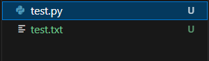
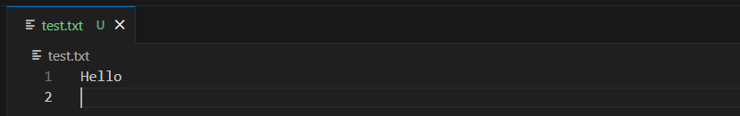

# Logging while Flask is running

> Trouble Shooting

`Flask`` 프레임워크를 사용하다가 API 요청이 주어졌을 때, 주어진 요청을 잘 handling하는지 확인하기 위해 단순히 `print`함수를 사용하여 값을 출력하려고 했는데 되지 않았다. 그에 대한 해결 방법을 기록한다.

```python
import sys

# Origin way
print("Something is printed.")

# Alternative way
print("Something is printed.", file=sys.stdout)
```

`print` 함수의 `file`인자는 `print` 함수가 출력을 진행할 파일 객체를 의미한다.
예를 들어 `test.txt` 라는 파일을 쓰기 모드로 하는 파일 객체 `file_obj`가 존재하고 그것을 `file` 인자로 전달하면 `test.txt`에 "Something is printed." 문자열이 출력되는 것이다.

정확한 레퍼런스는 모르겠으나, `Flask`를 사용하게 되면, `print` 함수의 `file` 인자가 `sys.stdout`이 아닌 다른 객체로 지정되기 때문에 이런 일이 발생하는 것으로 추정된다.

### Example

_디렉토리 구조_


다음과 같은 코드를 실행한 뒤, `test.txt`의 결과를 봐보자.
```python
# test.py
f = open("./test.txt", "w")
print("Hello", file=f)
```

_실행 이후 `test.txt`_
